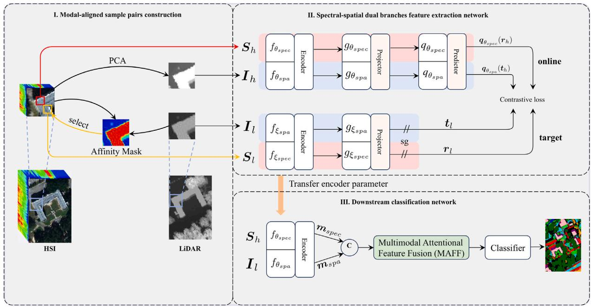

# MACL: Modal-aware Contrastive Learning for Hyperspectral and LiDAR Classification

Liangyu Zhou, Xiaoyan Luo, Rui Xue

School of Electronic and Information Engineering, Beihang University  
School of Astronautics, Beihang University

[](https://www.python.org/)
[](https://pytorch.org/)
[](https://doi.org/10.1016/j.imavis.2025.105669)

## Abstract

Contrastive learning has shown strong potential for hyperspectral image (HSI) and light detection and ranging (LiDAR) data classification. However, directly aligning HSI and LiDAR samples can ignore the large gap between their discriminative abilities: HSI is more informative in the spectral domain, while LiDAR is more effective in the spatial/elevation domain.

We propose **Modal-aware Contrastive Learning (MACL)**, a self-supervised multimodal framework for HSI and LiDAR classification. MACL constructs modal-aligned positive pairs in the spectral and spatial domains, learns multimodal features with two contrastive branches, and fuses the learned representations through a Multimodal Attentional Feature Fusion (MAFF) module for downstream classification with limited labeled samples. Experiments on MUUFL, Trento, and Houston2013 demonstrate the effectiveness of the proposed framework.

## Method



MACL contains three main components:

- **Modal-aligned sample pair construction**: builds spectral and spatial positive pairs by using the complementary strengths of HSI and LiDAR instead of directly forcing heterogeneous modalities to align.
- **Spectral-spatial dual-branch contrastive learning**: pre-trains a LiDAR-grounded spectral branch and an HSI-grounded spatial branch with BYOL-style online/target networks.
- **Multimodal Attentional Feature Fusion (MAFF)**: adaptively fuses spatial and spectral multimodal features before the final classifier.

## Prerequisites

### Installation

Create a conda environment and install the required packages:

```bash
conda create -n MACL python=3.8
conda activate MACL

pip install torch torchvision torchaudio
pip install numpy scipy scikit-learn matplotlib
```

The code has been tested with PyTorch and CUDA-enabled GPUs. CPU execution is supported by PyTorch, but training is expected to be slow.

### Repository Structure

```text
MACL
|-- config/              # Dataset-specific settings
|-- modelTool/           # Encoders, MLP heads, LARS optimizer, backbones
|-- utils/               # Data loading, metrics, visualization, checkpoints
|-- main.py              # Two-stage pre-training and classification pipeline
|-- model.py             # ContrastNet, MAFF, and classifier definitions
`-- generate RGB.py      # RGB visualization helper
```

## Datasets

This repository includes the processed MUUFL, Trento, and Houston2013 data used by MACL. The HSI, LiDAR, ground-truth, and HSI PCA files are organized as:

```text
datasets
|-- Trento
|   |-- HSI.mat
|   |-- LiDAR.mat
|   |-- gt.mat
|   `-- HSI_PCA.mat
|-- MUUFL
|   |-- HSI.mat
|   |-- LiDAR.mat
|   |-- gt.mat
|   `-- HSI_PCA.mat
`-- Houston
    |-- HSI.mat
    |-- LiDAR.mat
    |-- gt.mat
    `-- HSI_PCA.mat
```

These public datasets are provided for academic research and reproducibility. If you use them, please also cite the corresponding original dataset sources.

Dataset paths and training hyperparameters are defined in:

- `config/Trento.py`
- `config/Muufl.py`
- `config/Houston.py`

## Training and Evaluation

Set the target dataset in `main.py`:

```python
dataset_name = "Trento"  # options: "Trento", "Muufl", "Houston"
```

Then run:

```bash
python main.py
```

The script performs both stages:

1. **Contrastive pre-training** of the spatial and spectral encoders.
2. **Downstream classification** using the pre-trained encoders and MAFF classifier.

The best checkpoints are saved to:

```text
checkpoints/{dataset_name}/{model_name}/
```

Classification maps are generated through the visualization utilities in `utils/visualize.py`.

## Configuration

Each dataset config controls image size, band number, class number, patch size, contrastive pre-training settings, and classification settings. For example:

```python
cl_epochs = 50
cl_batch_size = 1024
train_per_class_Num = 10
c_epochs = 500
patch_lidar = 21
patch_hsi = 7
```

Adjust these values according to your GPU memory and experimental protocol.

## Citation

If MACL is helpful for your research, please cite our work:

```bibtex
@article{zhou2025macl,
  title={Modal-aware contrastive learning for hyperspectral and LiDAR classification},
  author={Zhou, Liangyu and Luo, Xiaoyan and Xue, Rui},
  journal={Image and Vision Computing},
  volume={162},
  pages={105669},
  year={2025},
  issn={0262-8856},
  doi={10.1016/j.imavis.2025.105669},
  url={https://doi.org/10.1016/j.imavis.2025.105669}
}
```

## Contact

For questions about the paper or code, please contact:

```text
liangyuzhou@buaa.edu.cn
```
